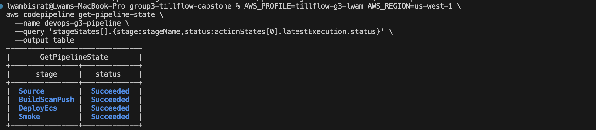
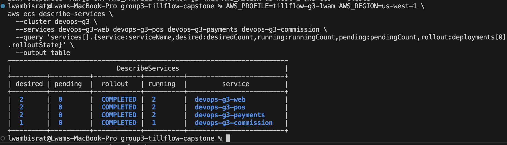
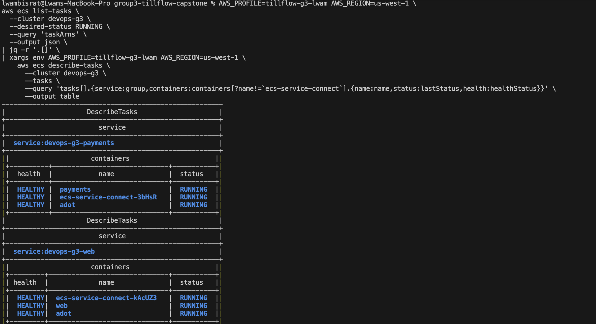
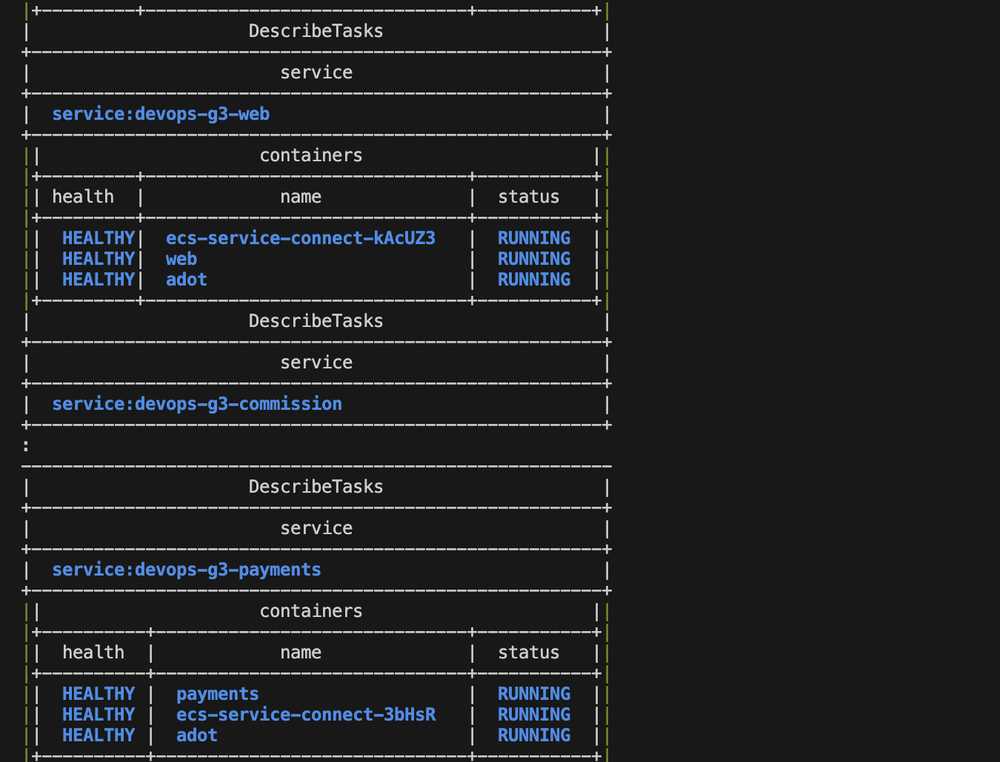
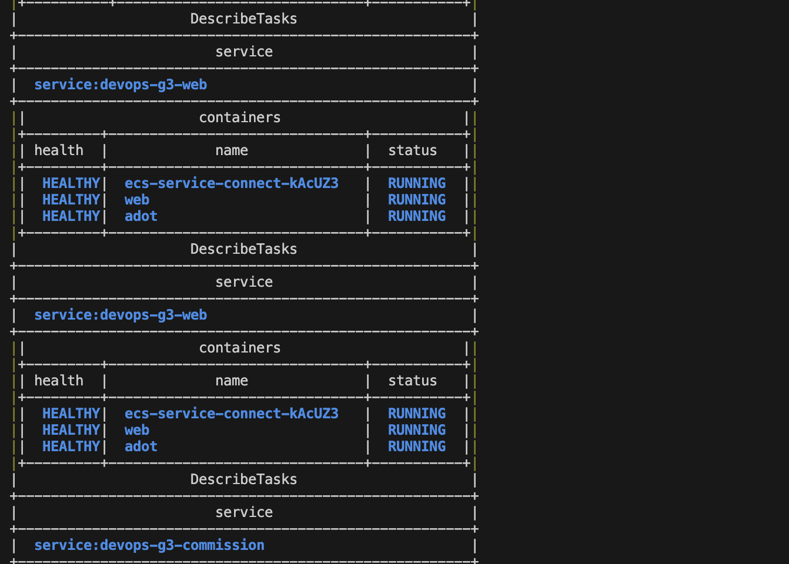
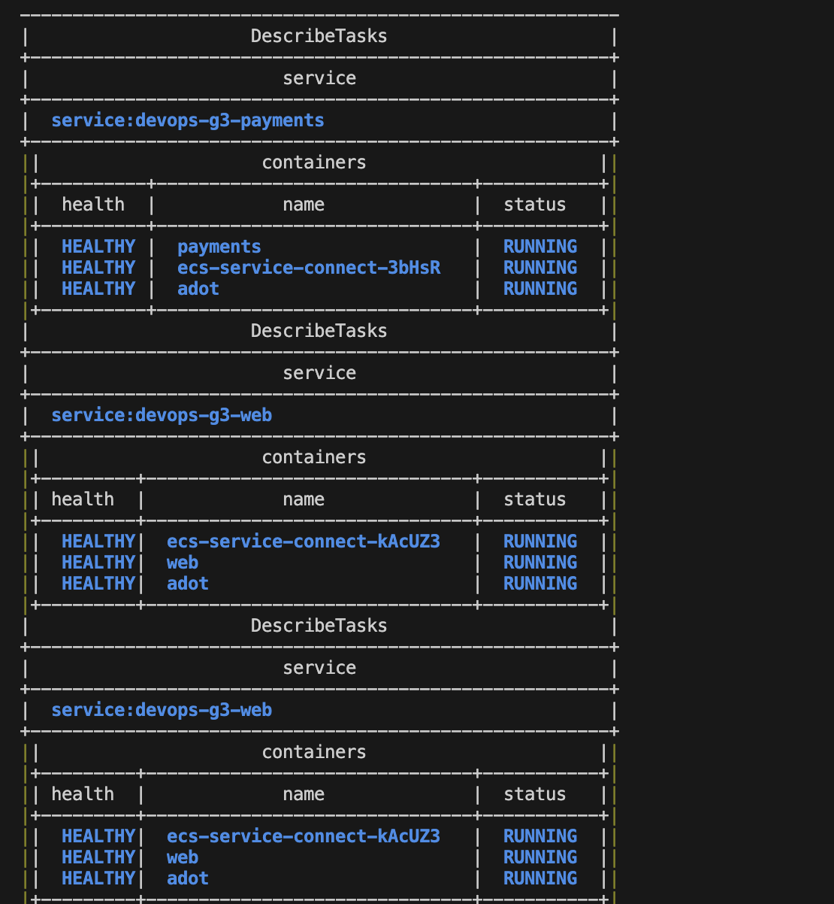
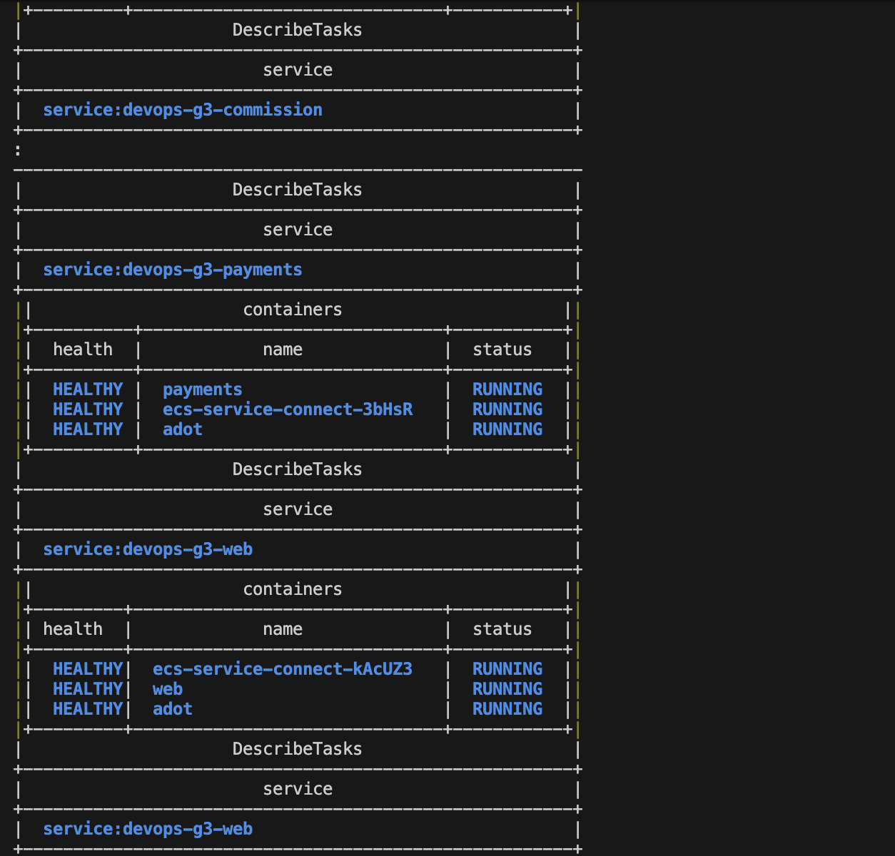
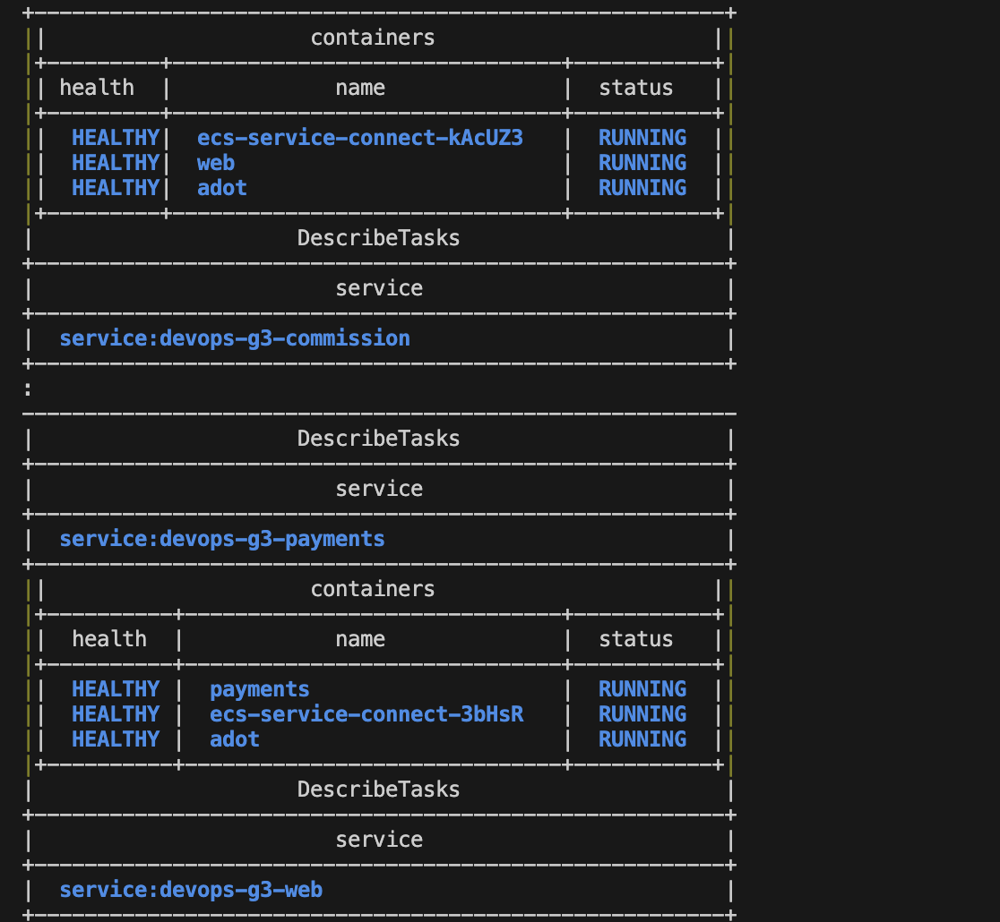
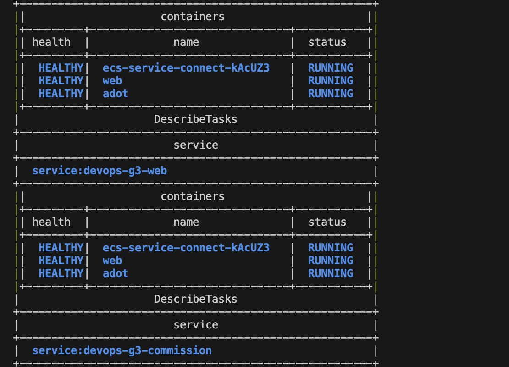
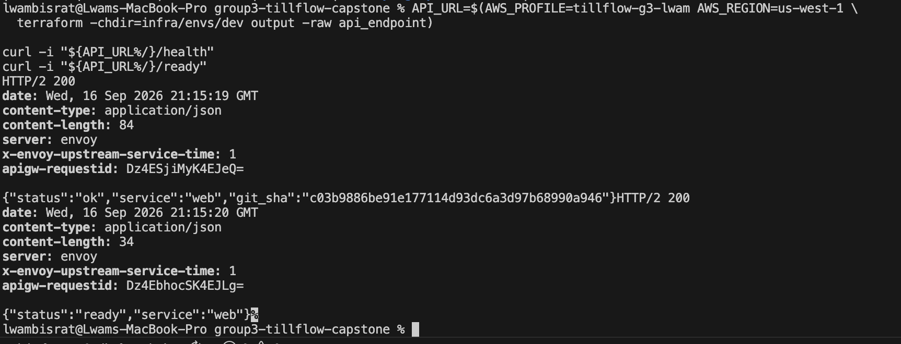

# Evidence — Delivery / CI-CD

**DRI: Wairimu** · cross-reviews Platform

Drop here, each with **exact reproduction commands** (screenshots alone earn no credit):

- [x] Commits / PR links for owned work (listed below)
- [x] ADR(s) for this area (listed below)
- [x] Tests (5 Terraform architecture tests passed)
- [x] Runtime proof (pipeline, ECS and endpoint results below)
- [x] Reproduction commands (included with each result below)

## G1 delivery evidence

Verified in AWS account `240462142849`, region `us-west-1`

### Traceability

- Delivery evidence and final ECS fixes:
  [`4514c1c`](https://github.com/WairimuNganga/group3-tillflow-capstone/commit/4514c1c)
- Deployed source revision:
  [`c03b9886`](https://github.com/WairimuNganga/group3-tillflow-capstone/commit/c03b9886be91e177114d93dc6a3d97b68990a946)
- Merged infrastructure PR:
  [#25](https://github.com/WairimuNganga/group3-tillflow-capstone/pull/25)
- CI/CD decisions: [ADR-009](../../docs/adr/ADR-009-ci-cd-promotion-and-rollback.md)
- Private networking decisions: [ADR-010](../../docs/adr/ADR-010-networking-topology.md)
- G5 rebuild prerequisite: [automated ADOT image mirror and manual recovery](../../docs/runbook.md#automated-adot-image-mirror)

### Screenshot evidence

#### Successful pipeline



#### ECS service capacity



#### ECS application and ADOT container health

The task output spans several terminal screenshots. Together, these show the
running application, ADOT and Service Connect containers reporting `HEALTHY`.

<details>
<summary>Open complete ECS container-health screenshot set</summary>















</details>

#### Public health and readiness checks



### CodePipeline

- Pipeline: `devops-g3-pipeline`
- Execution: `ebe3adc8-1007-4517-905e-c0a4fed48e2d`
- Source revision: `c03b9886be91e177114d93dc6a3d97b68990a946`
- Result: `Succeeded`

| Stage | Result |
| --- | --- |
| Source | Succeeded |
| BuildScanPush | Succeeded |
| DeployEcs | Succeeded |
| Smoke | Succeeded |

Reproduce the pipeline result:

```bash
AWS_PROFILE=tillflow-g3-lwam AWS_REGION=us-west-1 \
aws codepipeline get-pipeline-state \
  --name devops-g3-pipeline \
  --query 'stageStates[].{stage:stageName,status:actionStates[0].latestExecution.status}' \
  --output table
```

Observed output:

```text
Source          Succeeded
BuildScanPush   Succeeded
DeployEcs       Succeeded
Smoke           Succeeded
```

### ECS service capacity

| Service | Desired | Running | Pending | Rollout |
| --- | ---: | ---: | ---: | --- |
| `devops-g3-web` | 2 | 2 | 0 | COMPLETED |
| `devops-g3-pos` | 2 | 2 | 0 | COMPLETED |
| `devops-g3-payments` | 2 | 2 | 0 | COMPLETED |
| `devops-g3-commission` | 1 | 1 | 0 | COMPLETED |

Reproduce the service-capacity result:

```bash
AWS_PROFILE=tillflow-g3-lwam AWS_REGION=us-west-1 \
aws ecs describe-services \
  --cluster devops-g3 \
  --services devops-g3-web devops-g3-pos devops-g3-payments devops-g3-commission \
  --query 'services[].{service:serviceName,desired:desiredCount,running:runningCount,pending:pendingCount,rollout:deployments[0].rolloutState}' \
  --output table
```

Observed output:

```text
SERVICE                  DESIRED  RUNNING  PENDING  ROLLOUT
devops-g3-web                  2        2        0  COMPLETED
devops-g3-pos                  2        2        0  COMPLETED
devops-g3-payments             2        2        0  COMPLETED
devops-g3-commission           1        1        0  COMPLETED
```

### ECS container health

All seven running tasks were inspected. The `web`, `pos`, `payments` and
`commission` application containers, their `adot` sidecars, and their Service
Connect containers reported `RUNNING` and `HEALTHY`.

Reproduce the task-health result:

```bash
AWS_PROFILE=tillflow-g3-lwam AWS_REGION=us-west-1 \
aws ecs list-tasks \
  --cluster devops-g3 \
  --desired-status RUNNING \
  --query 'taskArns' \
  --output json \
| jq -r '.[]' \
| xargs env AWS_PROFILE=tillflow-g3-lwam AWS_REGION=us-west-1 \
    aws ecs describe-tasks \
      --cluster devops-g3 \
      --tasks \
      --query 'tasks[].{service:group,containers:containers[].{name:name,status:lastStatus,health:healthStatus}}' \
      --output json
```

Observed output, summarized across all seven running tasks:

```text
SERVICE      APP CONTAINERS             ADOT CONTAINERS
web          2 RUNNING / HEALTHY        2 RUNNING / HEALTHY
pos          2 RUNNING / HEALTHY        2 RUNNING / HEALTHY
payments     2 RUNNING / HEALTHY        2 RUNNING / HEALTHY
commission   1 RUNNING / HEALTHY        1 RUNNING / HEALTHY
```

### Public smoke checks

The public request path was verified through API Gateway, the VPC Link, the
internal ALB and the ECS web service.

`GET /health` returned:

```text
HTTP/2 200
content-type: application/json

{"status":"ok","service":"web","git_sha":"c03b9886be91e177114d93dc6a3d97b68990a946"}
```

`GET /ready` returned:

```text
HTTP/2 200
content-type: application/json

{"status":"ready","service":"web"}
```

Reproduce the public smoke checks:

```bash
API_URL=$(AWS_PROFILE=tillflow-g3-lwam AWS_REGION=us-west-1 \
  terraform -chdir=infra/envs/dev output -raw api_endpoint)

curl -fsS "${API_URL%/}/health"
curl -fsS "${API_URL%/}/ready"
```

### Terraform architecture tests

Reproduce the architecture tests:

```bash
terraform -chdir=infra/envs/dev test
```

Observed result:

```text
architecture_contracts                       pass
accepted_risk_guards                         pass
rejects_latest_tag                           pass
rejects_three_azs                            pass
rejects_fake_adapter_in_deployed_env         pass

Success! 5 passed, 0 failed.
```

### G1 completion checklist

- [x] Source reads `main` through the approved GitHub CodeConnection.
- [x] BuildScanPush builds and pushes all four service images to private ECR.
- [x] The image scan gate evaluates HIGH and CRITICAL findings.
- [x] Image tags and digests are published to SSM.
- [x] DeployEcs completes for all four services.
- [x] Every ECS service reaches its configured desired count.
- [x] Application and ADOT containers report healthy.
- [x] Smoke completes and the public `/health` and `/ready` routes return HTTP 200.
